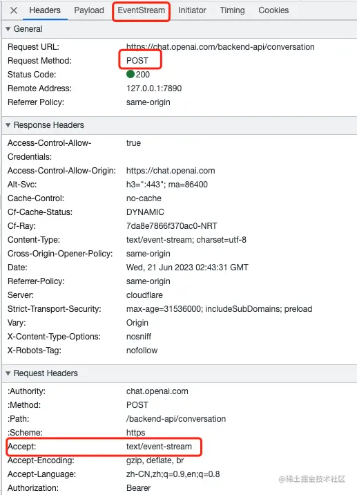
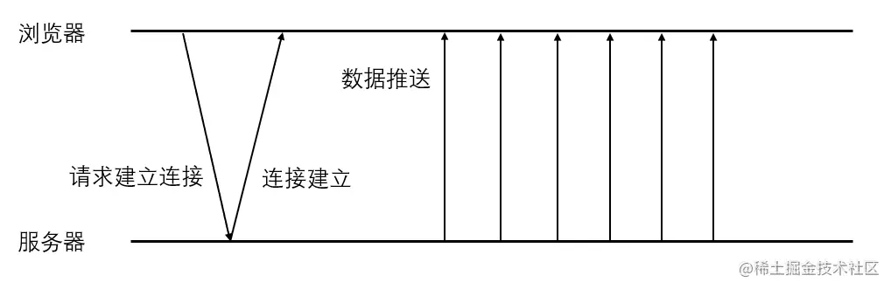

# ChatGPT 对话为什么不用 Websocket 而使用 EventSource？

在 ChatGPT 官网中，我们可以看到对话的方式仅仅只有一个 POST 请求，而没有使用 IM 中使用的 WebSocket 链接。

这个 POST 请求与普通的 POST 请求有所不同，返回信息 Response 没有了，取而代之的是 EventStream。

那么这个 EventStream 是什么东西？

EventStream 是 Web API 中的 EventSource 接口返回的数据。MDN 的官方描述是：EventSource 接口是 Web 内容与服务器发送事件。一个 EventSource 实例会对 HTTP 服务器开启一个持久化的连接，以 text/event-stream 格式发送事件，此连接会一直保持开启直到通过调用 EventSource.close() 关闭。

经过一番对比，总结了一下 EventSource 和 WebSocket 的区别和优劣：

## EventSource:

### 优势：

- 简单易用：EventSource API 非常简单，易于使用和理解。
- 服务器推送：EventSource 适用于服务器主动向客户端推送数据，客户端只能接收服务器发送的事件。
- 自动重连：EventSource 会自动处理连接断开和重新连接的情况，适用于长期保持连接并接收事件流的场景。
- 兼容性：EventSource 在大多数现代浏览器中得到支持。

### 劣势：

- 单向通信：EventSource 只支持从服务器到客户端的单向通信，客户端无法向服务器发送数据。
- 较少的功能：相比于 WebSocket，EventSource 提供的功能较为有限，仅限于接收服务器发送的事件。

## WebSocket:

### 优势：

- 双向通信：WebSocket 支持双向通信，客户端和服务器可以彼此发送数据。
- 实时性：WebSocket 提供了更低的延迟和更快的数据传输速度，适用于实时性要求较高的应用场景。
- 丰富的功能：WebSocket 提供了更多的功能，例如数据帧的自定义和二进制数据的传输等。

### 劣势：

- 复杂性：WebSocket API 相对于 EventSource 更为复杂，使用起来可能需要更多的代码和理解。
- 需要服务器支持：使用 WebSocket 需要服务器端实现对应的 WebSocket 协议，而 EventSource 只需要服务器端支持发送事件即可。
- 兼容性：相对于 EventSource，WebSocket 在某些较旧的浏览器或网络环境中的支持可能不够广泛。

综上所述，EventSource 适用于服务器主动推送事件给客户端，并且在保持长期连接和接收事件流时表现良好。WebSocket 适用于需要实时双向通信和更丰富功能的场景，但需要服务器端和客户端都支持 WebSocket 协议，选择使用哪种技术应基于具体需求和应用场景进行评估。

那么有了上面的结论我们再来看看，为什么 ChatGPT 对话为什么不用 WebSocket 而使用 EventSource？

当然，ChatGPT 对话可以使用 WebSocket 或 EventSource 进行实时通信。以下是可能的原因：

- 服务器推送：EventSource 专注于服务器向客户端主动推送事件的模型，这对于 ChatGPT 对话非常适用。ChatGPT 通常是作为一个长期运行的服务，当有新的回复可用时，服务器可以主动推送给客户端，而不需要客户端频繁发送请求。
- 自动重连和错误处理：EventSource 具有内置的自动重连机制，它会自动处理连接断开和重新连接的情况。这对于 ChatGPT 对话而言很重要，因为对话可能需要持续一段时间，连接的稳定性很重要。

-简单性和易用性：相对于 WebSocket，EventSource 的 API 更加简单易用，只需实例化一个 EventSource 对象，并处理服务器发送的事件即可。这使得开发者可以更快速地实现对话功能，减少了一些复杂性。

- 广泛的浏览器支持：EventSource 在大多数现代浏览器中得到广泛支持，包括移动端浏览器。相比之下，WebSocket 在某些旧版本的浏览器中可能不被完全支持，需要考虑兼容性问题。

需要注意的是，WebSocket 也是一种很好的选择，特别是当需要实现更复杂的实时双向通信、自定义协议等功能时，或者对浏览器的兼容性要求较高时。最终选择使用 WebSocket 还是 EventSource 应该根据具体的项目需求和技术考虑来确定。

总之，无论是 EventSource 还是 WebSocket，它们都是为了实现客户端和服务器之间的实时通信而设计的。在选择使用哪种技术时，应该根据项目需求和技术考虑来确定，以便为用户提供更好的体验。
